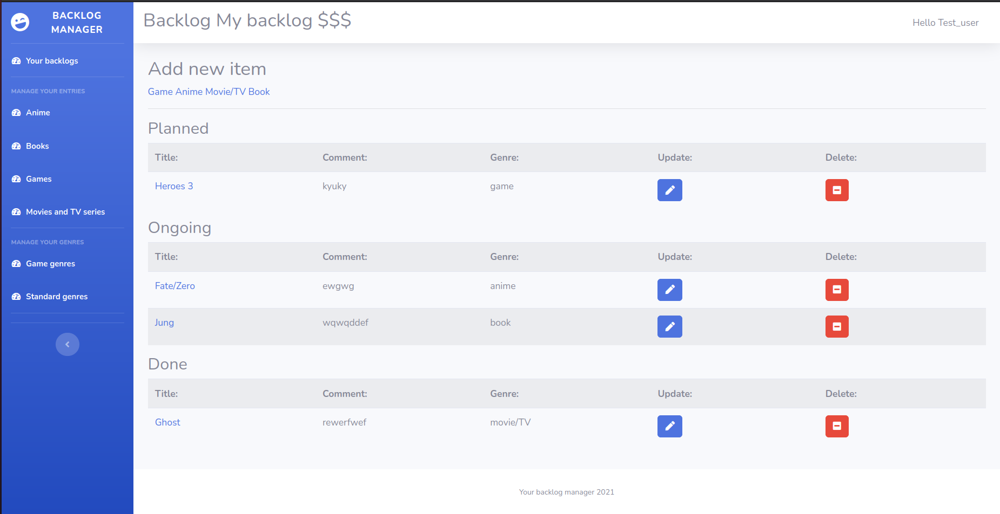

# Backlog manager

## Table of content

* [General info](#general-info)
* [Technologies](#technologies)
* [Setup](#setup)
* [Features](#features)
* [Sources](#sources)

## General info

A simple app to create one or more backlogs and fill them with entries organized by groups (default is for anime,
books, games and movies/tv series). Entries on the backlog can be further organized by their status 
(planned, ongoing, done) and in order you prefer (e.g. the most important on top of the list).

## Technologies

Project is created with:
* Python 3.8
* Django 3.1.6
* Bootstrap 4
* PostgreSQL 

## Setup

1. Create a fork of this repository
2. Clone the repository on your computer - use command `git clone repository_address`
3. Fill a `local_settings_example.py` file with your local configuration and rename as `local_settings.py`
4. Make a migration for a database: `python3 manage.py migrate`
5. Run your local server: `python3 manage.py runserver`
6. Create a new user and enjoy :)

## Features

* Add and manage backlog for your hobbies
* Organize them by easy adjustment of their priority

### To do:

* Add REST API to automatically check all basic information about your entries 
  (e.g. description, publisher, release date or Metacritic score)
* Develop databases of entries to better handle multiple users

## Sources

This app has been inspired by "[MyAnimeList.net](https://www.myanimelist.net)" website.